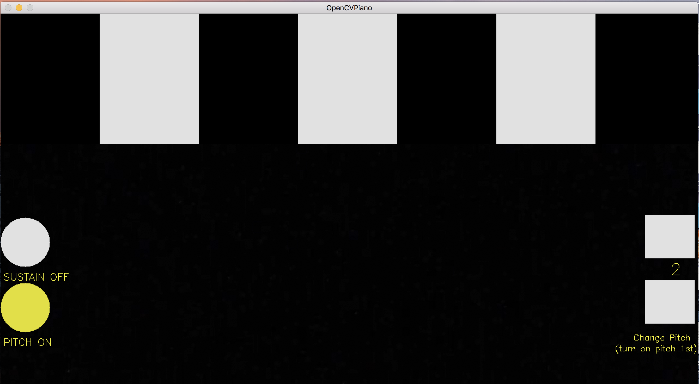
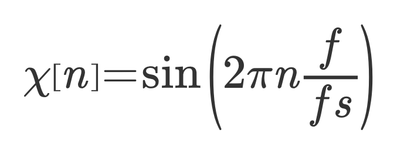
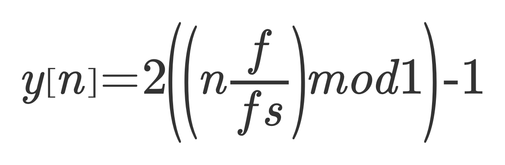

# OpenCVPiano :musical_keyboard:
###### contributors: Séan Keegan & Deirdre Hegarty

This is an OpenCV application which plays a piano. Based on RDMilligan's https://rdmilligan.wordpress.com/2015/10/22/paper-piano-using-python-and-opencv/

Simply run `main.py`. Stay very still when you run it :guardsman: and move slowly to see the output. :turtle:

## Required (Mac OS):

* Python 2.7
* openCV 2
* pyaudio

```bash

# installing pyaudio with pip and brew

brew install portaudio
brew link portaudio
pip install pyaudio

```



## How to Interact

* stuff about sawtooth selection here (when starting main.py)

#### Keyboard:
Ensure that the camera is on a steady surface and the background is relatively static (any movement will trigger a detection). Stand inline with the center of the screen, keeping limbs a distance away from both the keyboard and buttons (i.e. where there are no trigger points).

To trigger a note, raise your arm into the space of the desired note. The note will sound briefly. Should you wish for the note to play again, simply wave your arm in place to trigger the motion detection.


**The buttons can be interacted with in the same way as the keyboard at the top of the screen.** 

#### Sustain Button:
This button controls the duration of each note. This can be toggled on and off by hitting.

#### Pitch Button & Up/Down Buttons:
By default the frequency of the note is 1. This corresponds to the keys at the top of the screen - starting on middle C. By raising this number to 2, the user can change the octave of the corresponding note on the keyboard.

To successfully change the frequency value, the user must first 'turn on' pitch by selecting the pitch button at the left-hand side of the screen. Once this button has been selected, the user may now toggle the value of the frequency. The up and down buttons are on the right-hand side of the screen, along with the current value for frequency.

The frequency value resets to the default value of 1 by 'turning off' the pitch.


## How it Works

#### Keyboard:
An array stores the dimensions of each of the keyboard keys. Black and white pixels are drawn over the area of each respective key into the camera feed image. In order to detect if a key has been hit, the application subtracts each frame from the previous and checks for a substantial difference (in accordance to some threshold).

The key with the most activity is returned. This can now be used to trigger the correct auditory response.

```python

# store motion level for each cell
cells = np.array([0, 0, 0, 0, 0, 0, 0])

# ...

# visual black & white 'piano keys'
image[0:height, 0:cell_width] = (0,0,0)

# ...

# obtain the most active cell
top_cell =  np.argmax(cells)

# return the most active cell, if threshold met
if(cells[top_cell] >= self.THRESHOLD):
    return top_cell
else:
    return None

```

In the main, once the information has been received about which key has been hit, the correct sound can be triggered. The camera feed continues if nothing has been hit.

```python

# if switch on, play note
if switch:
        sound.playTone(0.5,44100,duration,NOTES[cell],detection.num, wave)

# alternate switch
switch = not switch

```


#### Buttons:
Detection for button clicks is the same as that for the keyboard keys. Each button however, has a little extra functionality to allow for smooth interaction.

```python

# adjust freq number up and down
    if(checkUpArrow >= self.THRESHOLD and time.time() - self.previousTime >= 2):
        self.num += 1
        self.previousTime = time.time()

```

The if statement in the above code checks if the difference between that specific area of the screen is substantially different than that of the same area one frame previous (i.e. each frame from the live camera feed is differenced). This check is also done for each of the piano keys. 

The if statement also checks if the current timestamp is at least 2 more seconds than the last button click. This check is introduced to ensure that the button is "clicked" once, and not a multiple of times when a user tries to hit it once.

When both of these conditions are met, the frequency number is updated; in this case incremented. It is important that the frequency number belongs to the detection class. This is to make sure that the variable can be statically updated. The timestamp is also recorded for the next check.


```python

# toggle duration between 'ON' & 'OFF'
if(checkDurationCell >= self.THRESHOLD and time.time() - self.previousTime >= 2):
    webcam.toggleDuration = not webcam.toggleDuration
    self.previousTime = time.time()
            
```

The code for toggling on and off the duration functionality has the same conditions as the previous code, however the code inside the if statement is slightly different. If the duration is 'on' it will be turned 'off' and vice-versa. Again the timestamp is recorded. This allows for the user to be able to toggle this option on and off .


#### Sound

```python
def playTone(volume,sampleRate,duration,freq,factor,wave):

# ...

samples = (np.sin(2*np.pi*np.arange(fs*duration)*f/fs)).astype(np.float32)

```

The above code demonstrates what is needed to generate samples. Factors such as the sample rate and frequency have been passed to the method `playTone()`. The sample rate `fs` has been set at a constant 44100Hz. The frequency f can be altered by the user, along with note duration and the type of wave to be generated.

pyAudio allows for a stream to be opened. Within this stream samples can be generated in accordance with the previously set values for fs, f, volume etc. These sample values must be in range [-1.0, 1.0].

```python

def speedxFactor(sound_array, factor):

# ...

indices = np.round(np.arange(0, len(sound_array), factor))
indices = indices[indices < len(sound_array)].astype(int)

```
`speedxFactor`'s parameters are controlled by the user. It is this function that allows for the frequency to be changed. Each sample is stored as part of an array. This array can then be iterated and altered by the `factor`. An example of this would be if `factor = 2`, every second sample in the array would be stored into a new array of half the size. Because the nature of this, the returned audio will be half of the original speed.

### How Sound is Produced 

The application produces sound using the following formula:



This produces a sine wave and using the values contained in the `NOTES` array, creates the notes of the octave beginning with Middle C. These values relate to the frequency in Hertz of the wave, i.e. 262 Hz = Middle C

The application can also produce Sawtooth waves using the following formula:



The default wave generated is a sine wave. However to change the type of wave produced, simply type it as a parameter:


```bash

$/python main.py saw

```


The application aims to simulate a piano/keyboard as close as possible. To this end it includes the ability to sustain a note. In composition of piano music, sustaining a note is a accomplished by depressing a pedal at the base of the piano, releasing the dampeners on the strings and allowing them to vibrate freely until the pedal is released or the strings stop naturally. 

In this program, sustaining a note is achieved by toggling the “Sustain” button. This is the equivalent of depressing and releasing the pedal and changes the amount of time the note is generated for.  


